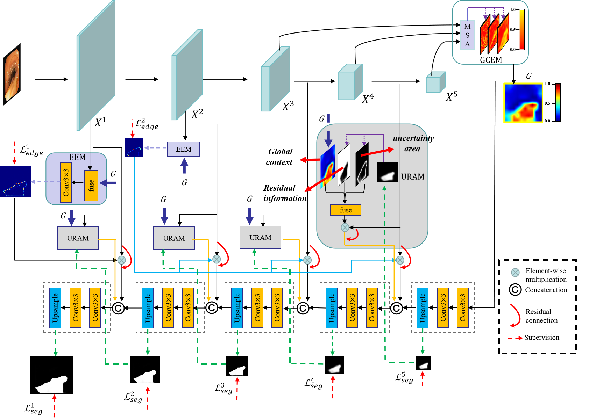
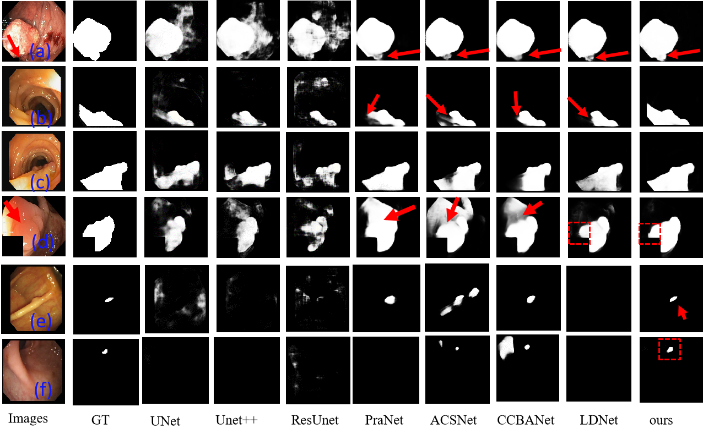
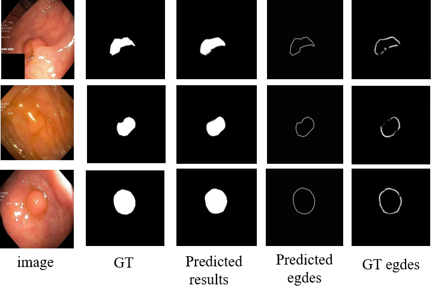

#  Joint Edge-aware and Global context for polyp segmentation with cross-layer mapping


##  Requirements

* torch
* torchvision 
* tqdm
* opencv
* scipy
* skimage
* PIL
* numpy
### 1. Framework Overview

<p align="center">
     <br />
    <em> 
    Figure 1: Overview of the proposed JEGNet.
    </em>
</p>

### 2. Training

```bash
python train.py  --mode train  --dataset kvasir_SEG  
--train_data_dir /path  --valid_data_dir  /path
```

###  3. Inference

```bash
python test.py  --mode test  --load_ckpt checkpoint 
--dataset kvasir_SEG    --test_data_dir  /path
```
###  4. result
<p align="center">
     <br />
    <em> 
    Figure 2: vison of result.
    </em>
</p>
<p align="center">
     <br />
    <em> 
    Figure 3: vison of edge segmentation.
    </em>
</p>

